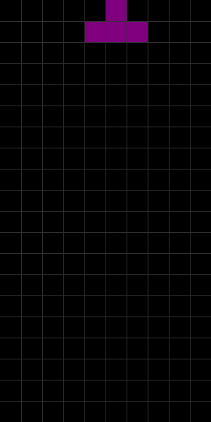
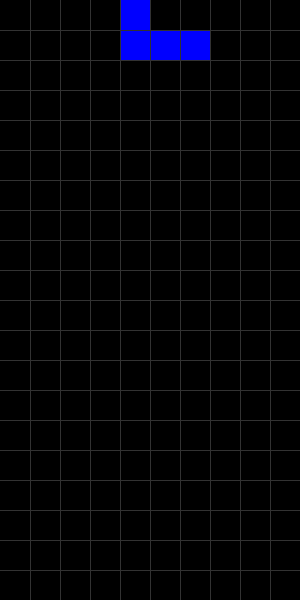

# Tetris Deep Reinforcement Learning


# Visualization

```python
python gif.py
```

## Random agent


## Trained agent


# Tensorboard

```
tensorboard --logdir logs
```

## Tensorboard vscode itegration

Recommendation
```
pip install torch-tb-profiler
```
